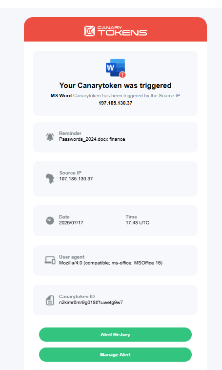

# Canary Lab — Deception Detection with Thinkst Canarytokens
**Author:** Brian Pfeka | @rayoni_ir | SOC Analyst | Randburg, RSA
**Purpose:** Research for Solutions Engineer (Deception/Detection) — Thinkst Applied Research

### Overview
Lab to understand how attackers enumerate after initial access and where deception provides high-fidelity alerts vs noisy SIEM/EDR.

### Lab Setup
- Attacker: Kali Linux 2024.3 (VMware)
- Victim: Windows 10 Pro (Finance user)
- File Share: Windows Server 2019 - Shared folder `\\FILE-SRV\Finance$\`
- Monitoring: Canarytokens.org, Wireshark, Sysmon, Gmail alerts

### What I Deployed
1. **AWS API Key Canary** -> Planted in `C:\Users\Finance\Documents\.env` and fake `config.env`
   - Simulates T1552.001 - Credentials in Files
2. **MS Word Canary** -> `Passwords_2024.docx` on Desktop
   - Simulates T1003 - Credential Access / Collection
3. **Windows Folder Canary** -> `Admin-Backups` inside Finance share
   - Simulates T1083 - File and Directory Discovery

### How I Simulated The Attack
1. Started as low-priv user on Victim PC
2. Ran `dir /s`, `type config.env` — found AWS key
3. Double-clicked Passwords_2024.docx — triggered DNS callback
4. Browsed to \\FILE-SRV\Finance$\Admin-Backups — triggered Folder canary
5. Observed: No AV alert. Canary email alert received in <3 mins with source IP and user-agent.

### Alert Sample [Add your screenshot here]
> Triggered: Word Doc Canary
> Time: 2026-05-11 09:14 SAST
> IP: 41.***.***.*** (my home IP)
> User-Agent: Microsoft Office

### Why This Matters for SOC
- QRadar/SentinelOne: 100s of alerts/day, needs tuning
- Canary: 1 alert = 1 true positive. No legitimate user should touch these files.
- Perfect for early warning post-compromise.

### MITRE ATT&CK Mapping
- T1566.001 Phishing
- T1083 File Discovery
- T1552.001 Credentials in Files
- T1021 Remote Services
- T1078 Valid Accounts

### Next Steps
- Deploy full Canary VM in server VLAN (no legit traffic = any traffic is malicious)
- Integrate alert to SOAR -> auto-isolate host in SentinelOne
- Test Canary AD honey accounts

---
Lab for personal learning. Tokens from canarytokens.org by Thinkst.
